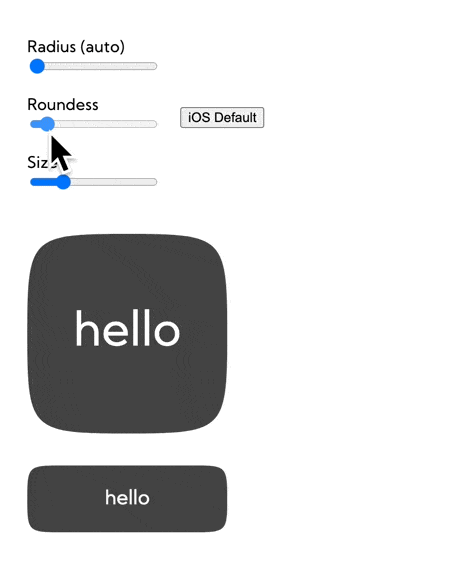
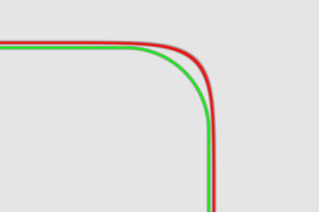
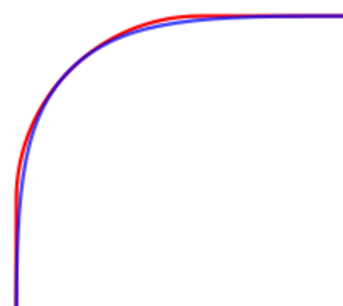

## React ios corners



Create ios like rounded corners (squircle). Comparsion with regular border radius:





Playing with different 'roundness' setting, you can achieve look similar to iOS home screen app icons etc.

Links

https://en.wikipedia.org/wiki/Squircle

https://medium.com/minimal-notes/rounded-corners-in-the-apple-ecosystem-1b3f45e18fcc (Highly recommending!)

## Usage

```tsx
import { Squircle } from 'react-ios-corners';

function MyComponent() {
  return <Squircle>Hello</Squircle>;
}
```

## Properties

```ts
export interface SquircleProps {
  radius?: number | 'auto';
  roundness?: number; // 0-1
}
```

It also accept any `div` property and passes it to the holder.

Note: `box-shadow` will not be visible because under the hood squircle is based on css masks.
